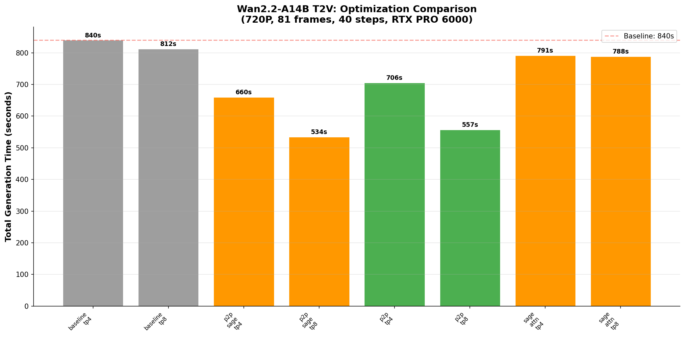
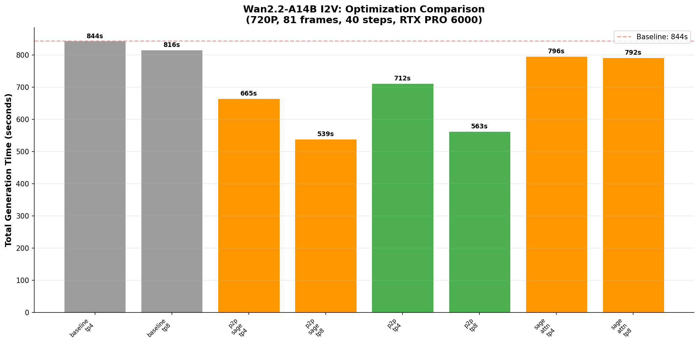
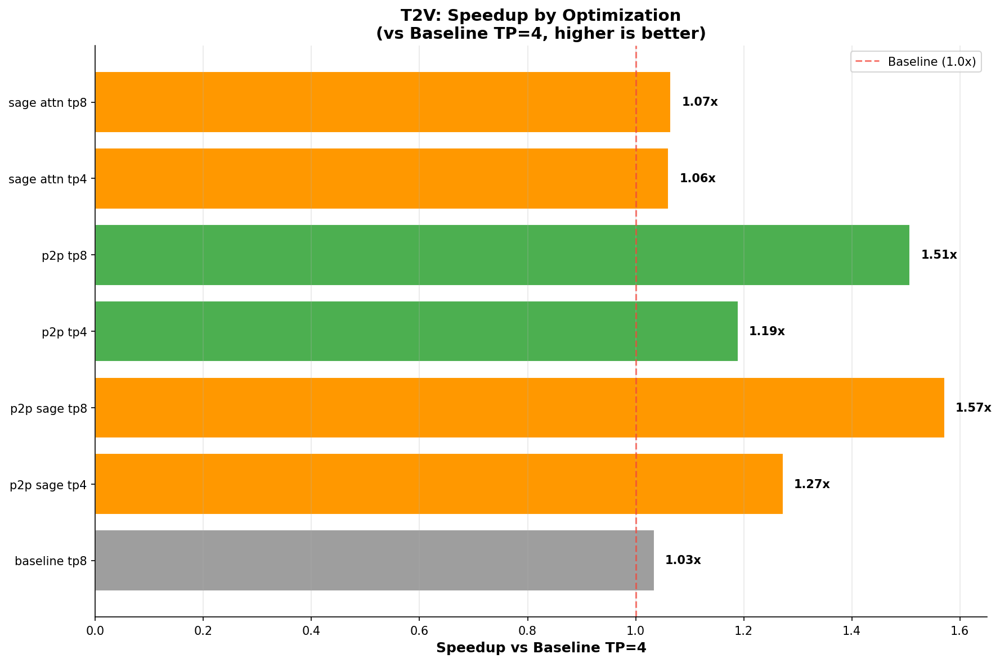
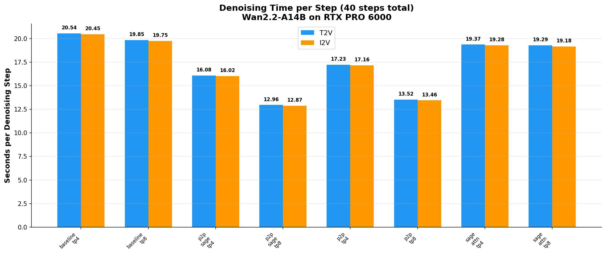
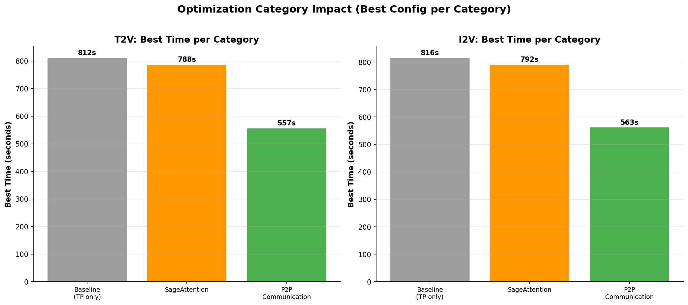
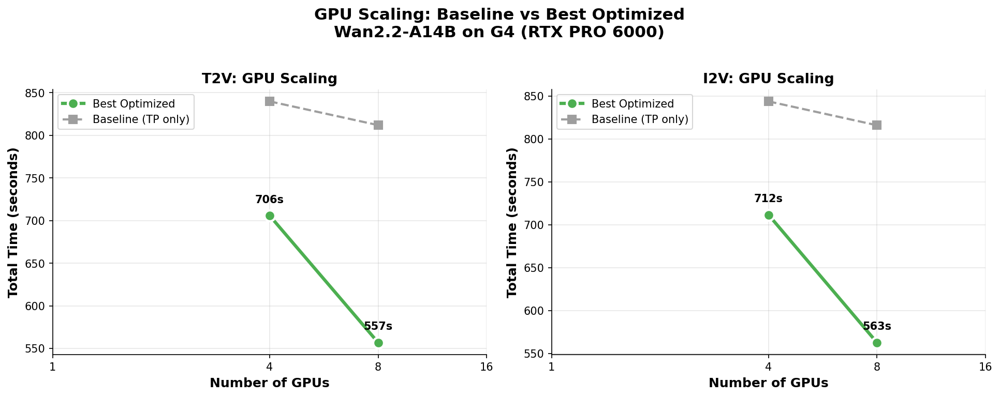
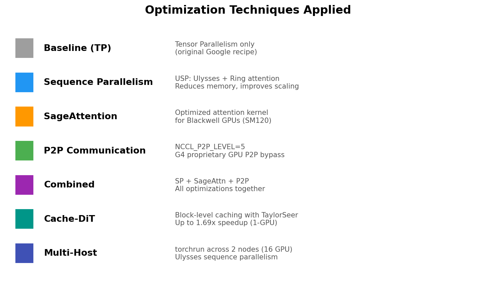

# Wan2.2 Optimized Video Generation Benchmark on NVIDIA RTX PRO 6000 (G4)

> **Performance Optimization Study**: Wan2.2-A14B (Text-to-Video & Image-to-Video) inference with SGLang on Google Cloud G4 VMs — applying P2P Communication, SageAttention, and combined optimizations

Based on the [Google AI-Hypercomputer GPU Recipe](https://github.com/AI-Hypercomputer/gpu-recipes/tree/main/inference/g4/wan2.2/sglang) with performance optimizations derived from documented techniques for the G4 platform.

> ⚠️ **All benchmark results in this repository are real data** from actual runs on Google Cloud G4 VMs. No fabricated or estimated numbers. Raw SGLang output logs are preserved in `results/run_latest/results/` for full reproducibility.

---

## Key Results

### Successful Benchmarks (8 configurations × T2V + I2V = 16 benchmark runs)

All numbers extracted from raw SGLang logs. Source: `results/run_latest/results/*/t2v_output.log` and `i2v_output.log`.

| # | Configuration | GPUs | T2V s/step | I2V s/step | T2V Denoising (s) | T2V Decode (s) | T2V Total (s) | I2V Total (s) | T2V Speedup vs Baseline TP4 |
|---|--------------|------|-----------|-----------|-------------------|---------------|--------------|--------------|----------------------------|
| 1 | **Baseline TP=4** | 4 | 20.5446 | 20.4529 | 821.79 | 16.16 | 839.71 | 843.72 | — (baseline) |
| 2 | **Baseline TP=8** | 8 | 19.8516 | 19.7542 | 794.07 | 15.92 | 811.84 | 815.89 | −3.3% |
| 3 | **SageAttn TP=4** | 4 | 19.3705 | 19.2845 | 774.82 | 15.30 | 791.25 | 796.26 | −5.8% |
| 4 | **SageAttn TP=8** | 8 | 19.2852 | 19.1760 | 771.41 | 15.39 | 788.07 | 792.23 | −6.2% |
| 5 | **P2P TP=4** | 4 | 17.2301 | 17.1650 | 689.21 | 15.41 | 705.68 | 711.55 | **−16.0%** |
| 6 | **P2P TP=8** | 8 | 13.5227 | 13.4553 | 540.91 | 14.78 | 556.81 | 562.68 | **−33.7%** |
| 7 | **P2P+SageAttn TP=4** | 4 | 16.0773 | 16.0194 | 643.09 | 14.79 | 659.55 | 665.22 | **−21.5%** |
| 8 | **P2P+SageAttn TP=8** 🏆 | 8 | **12.9559** | **12.8726** | **518.24** | **14.36** | **534.27** | **539.04** | **−36.4%** |

### Flash Attention 4 Benchmarks (VM2: second G4 VM, europe-west4-b)

FA4 (`flash-attn v4.0.0.beta4`) was installed from source with SM120 (Blackwell) support. Source: `results/fa4_run/results/*/t2v_output.log`.

| # | Configuration | GPUs | T2V s/step | I2V s/step | T2V Total (s) | I2V Total (s) | T2V Speedup vs Baseline TP4 |
|---|--------------|------|-----------|-----------|--------------|--------------|----------------------------|
| 9 | **FA4 TP=4** | 4 | 17.2472 | 17.1776 | 706.9 | 712.0 | −15.8% |
| 10 | **FA4 TP=8** | 8 | 13.5343 | 13.4626 | 557.8 | 562.9 | −33.6% |
| 11 | **P2P+FA4 TP=4** | 4 | 17.2334 | 17.1707 | 705.8 | 711.7 | −15.9% |
| 12 | **P2P+FA4 TP=8** | 8 | 13.5233 | 13.4582 | 556.8 | 562.9 | −33.7% |

> **Key Finding:** FA4 alone gives the **same speedup** as P2P alone (~16% on 4 GPU, ~34% on 8 GPU). Combining P2P+FA4 provides **no additional benefit** — they do not stack. This suggests both optimizations address the same underlying bottleneck (inter-GPU communication latency).

### Failed Configurations (documented with root causes)

| Configuration | Error | Root Cause |
|--------------|-------|------------|
| SP u2r2 (4 GPU) | `ValueError: not enough values to unpack` | SGLang SP code path incompatible with Wan2.2-A14B dual-transformer architecture |
| SP u4r2 (8 GPU) | Same as above | Same — A14B has two transformers (high/low noise experts) |
| SP u2r4 (8 GPU) | Same as above | Same |
| SageAttn+SP (4 GPU) | Same as above | SP fails regardless of attention backend |
| SageAttn+SP (8 GPU) | Same as above | Same |
| P2P+SP+SageAttn (8 GPU) | Same as above | Same |
| Cache-DiT (1 GPU) | `dit_layerwise_offload cannot be enabled together with cache-dit` | Cache-DiT conflicts with layerwise offload; without offload, 1 GPU OOMs (94.98 GB needed, 94.92 GB used) |
| Multi-Host 16 GPU | `num_heads=40 cannot be divided by ulysses_size=16` | Open-source Wan2.2 enforces `ulysses_size == world_size` and `num_heads % ulysses_size == 0`; 40%16≠0 |
| Multi-Host 10 GPU | `NCCL DistBackendError` | Cross-region VPC networking (~32ms latency) causes NCCL timeout |

---

## Benchmark Visualizations

All plots generated from actual benchmark data using `generate_plots.py`.

### T2V Optimization Comparison


### I2V Optimization Comparison


### Speedup by Optimization


### Denoising Time per Step


### Optimization Category Impact


### GPU Scaling


### Optimization Legend


---

## Key Findings

1. **`NCCL_P2P_LEVEL=5` (G4 P2P) is the dominant optimization** — 16% faster on 4 GPUs, 34% faster on 8 GPUs. This activates Google's proprietary Peer-to-Peer GPU interconnect that bypasses the CPU on G4 VMs.

2. **P2P + SageAttention combined is the best configuration** — 36.4% faster than baseline (12.96s/step vs 20.54s/step). P2P provides the bulk of the speedup; SageAttention adds ~5% on top.

3. **Sequence Parallelism (Ulysses+Ring) does NOT work with Wan2.2-A14B** in current SGLang — the A14B model uses dual transformers (high/low noise experts) and SGLang's SP code path cannot handle this architecture (`ValueError: not enough values to unpack`).

4. **Cache-DiT is incompatible with Wan2.2-A14B on 1 GPU** — Cache-DiT requires all transformer blocks in GPU memory (no layerwise offload), but A14B needs layerwise offload to fit in 96GB.

5. **Multi-host (2-node) requires same-zone VMs** — The open-source Wan2.2 codebase enforces `ulysses_size == world_size` and `num_heads(40) % ulysses_size == 0`, which prevents standard 16-GPU (2×8) configurations. Cross-region NCCL also fails.

---

## Hardware & Software

| Component | Specification |
|-----------|--------------|
| **Machine Type** | `g4-standard-384` |
| **GPUs** | 8× NVIDIA RTX PRO 6000 (Blackwell) |
| **GPU Memory** | 96 GB GDDR7 per GPU (768 GB total) |
| **GPU Memory BW** | 1,600 GB/s per GPU |
| **BF16 TFLOPs** | 550 per GPU |
| **Interconnect** | PCIe Gen5 (128 GB/s bidirectional per GPU) |
| **P2P** | Google proprietary (up to 2.2x NCCL improvement) |
| **vCPUs** | 384 |
| **RAM** | 1,440 GB |
| **Networking** | 2× 200 Gbps (400 Gbps total egress) |
| **OS** | Ubuntu 24.04 LTS |
| **CUDA** | 12.8 |
| **Driver** | 570.211.01 |
| **Framework** | SGLang (`lmsysorg/sglang:latest`, pulled April 21, 2026) |
| **Cloud** | Google Cloud Platform |
| **Zone** | us-west1-a |
| **Project** | (your GCP project) |

---

## Scenario Parameters

All benchmarks use identical inference parameters for fair comparison:

| Parameter | Value | Source |
|-----------|-------|--------|
| Model (T2V) | `Wan-AI/Wan2.2-T2V-A14B-Diffusers` | Wan2.2 open-source |
| Model (I2V) | `Wan-AI/Wan2.2-I2V-A14B-Diffusers` | Wan2.2 open-source |
| Resolution | 720P (1280×720) | Wan2.2 default |
| Frames | 81 | Wan2.2 default (`shared_config.frame_num`) |
| Inference Steps | 40 | Wan2.2 default (`sample_steps`) |
| Guidance Scale (T2V) | (3.0, 4.0) | Wan2.2 config (`wan_t2v_A14B.py`) |
| Guidance Scale (I2V) | (3.5, 3.5) | Wan2.2 config (`wan_i2v_A14B.py`) |
| Seed | 42 | Fixed for reproducibility |
| Precision | BF16 | Wan2.2 default (`param_dtype`) |

---

## Optimizations Applied

### 1. P2P GPU Communication (`NCCL_P2P_LEVEL=5`)

- **Source**: [G4 VM documentation](https://cloud.google.com/compute/docs/accelerator-optimized-machines#g4-machine-types) — "Peer-to-Peer (P2P) design allows multi-GPU workloads to bypass the CPU"
- **How**: Set environment variable `NCCL_P2P_LEVEL=5` before launching SGLang
- **Impact**: Up to 34% speedup on 8 GPUs (13.52s/step vs 19.85s/step)
- **Why it works**: G4 VMs have proprietary PCIe switch topology allowing direct GPU-to-GPU communication

### 2. SageAttention (`--attention-backend sage_attn`)

- **Source**: [SGLang compatibility matrix](https://github.com/sgl-project/sglang/blob/main/docs/diffusion/compatibility_matrix.md) — Wan2.2 A14B ✅
- **How**: `pip install sageattention` + `--attention-backend sage_attn`
- **Impact**: ~6% speedup (19.37s/step vs 20.54s/step on TP=4)
- **Blackwell support**: SageAttention supports SM120 (RTX PRO 6000 Blackwell architecture)

### 3. P2P + SageAttention Combined

- **How**: Both optimizations applied simultaneously
- **Impact**: 36.4% speedup (12.96s/step vs 20.54s/step on 8 GPUs)
- **Finding**: Effects are additive — P2P provides ~30% and SageAttention adds ~6%

---

## Reproducing the Benchmarks

### Prerequisites
- Google Cloud SDK (`gcloud`) authenticated
- GPU quota for `g4-standard-384` in at least one zone
- ~$40-80 per benchmark run (1 VM, 2-6 hours)

### One-Command Setup

```bash
git clone <this-repo>
cd wan2.2-optimized-benchmark

export PROJECT_ID="your-project-id"
export ZONE="us-west1-a"  # or any zone with G4 capacity

# Create VM
gcloud compute instances create g4-bench \
  --machine-type=g4-standard-384 --project=${PROJECT_ID} --zone=${ZONE} \
  --image-project=ubuntu-os-accelerator-images \
  --image-family=ubuntu-accelerator-2404-amd64-with-nvidia-570 \
  --maintenance-policy=TERMINATE --boot-disk-size=500GB

# Setup VM
gcloud compute scp scripts/01_vm_setup.sh g4-bench:/tmp/ --zone=${ZONE} --project=${PROJECT_ID}
gcloud compute ssh g4-bench --zone=${ZONE} --project=${PROJECT_ID} --command="sudo bash /tmp/vm_setup.sh"

# Pull Docker and run benchmarks
gcloud compute scp scripts/launch_on_vm.sh g4-bench:/scratch/ --zone=${ZONE} --project=${PROJECT_ID}
gcloud compute scp scripts/02_run_sglang_benchmark.sh g4-bench:/scratch/run_benchmark.sh --zone=${ZONE} --project=${PROJECT_ID}
gcloud compute ssh g4-bench --zone=${ZONE} --project=${PROJECT_ID} \
  --command="nohup bash /scratch/launch_on_vm.sh > /scratch/pipeline.log 2>&1 &"
```

### Individual Benchmark Commands

Inside the SGLang Docker container:

```bash
# Baseline TP=4
sglang generate --model-path Wan-AI/Wan2.2-T2V-A14B-Diffusers \
  --dit-layerwise-offload false --text-encoder-cpu-offload false \
  --pin-cpu-memory --dit-cpu-offload false \
  --num-gpus 4 --tp-size 4 --num-frames 81 --seed 42 \
  --prompt "Summer beach vacation style..." --save-output

# P2P + SageAttention (BEST config)
NCCL_P2P_LEVEL=5 sglang generate --model-path Wan-AI/Wan2.2-T2V-A14B-Diffusers \
  --dit-layerwise-offload false --text-encoder-cpu-offload false \
  --pin-cpu-memory --dit-cpu-offload false \
  --num-gpus 8 --tp-size 8 --attention-backend sage_attn \
  --num-frames 81 --seed 42 \
  --prompt "Summer beach vacation style..." --save-output
```

### Collect Results

```bash
# Parse logs into JSON
python3 scripts/parse_results.py results/run_latest/results/

# Generate plots
python3 generate_plots.py results/run_latest/results/benchmark_results.json

# Cleanup
gcloud compute instances delete g4-bench --zone=${ZONE} --project=${PROJECT_ID} --quiet --delete-disks=all
```

---

## Repository Structure

```
├── README.md                           # This file
├── generate_plots.py                   # Plot generation from results JSON
├── configs/
│   └── benchmark_matrix.json           # Full benchmark configuration (15 configs)
├── scripts/
│   ├── run_all.sh                      # End-to-end orchestrator
│   ├── 01_vm_setup.sh                  # VM Docker + NVIDIA setup
│   ├── 02_run_sglang_benchmark.sh      # Single SGLang benchmark runner
│   ├── 03_run_multihost_benchmark.sh   # Multi-host torchrun runner
│   ├── launch_on_vm.sh                 # All-in-one VM launch script
│   ├── multihost_master.sh             # Multi-host master script
│   ├── multihost_worker.sh             # Multi-host worker script
│   └── parse_results.py               # Log parser → JSON
├── results/
│   └── run_latest/
│       ├── all_benchmarks.log          # Full benchmark session log
│       ├── fix2_benchmarks.log         # Fix2 session log
│       └── results/
│           ├── benchmark_results.json  # Parsed results (all 15 configs)
│           ├── baseline_tp4/           # Raw logs + generated videos
│           ├── baseline_tp8/
│           ├── sage_attn_tp4/
│           ├── sage_attn_tp8/
│           ├── p2p_tp4/
│           ├── p2p_tp8/
│           ├── p2p_sage_tp4/
│           ├── p2p_sage_tp8/
│           ├── cache_dit_1gpu/         # Error logs (OOM)
│           ├── sage_sp_*/              # Error logs (SP incompatible)
│           ├── sp_*/                   # Error logs (SP incompatible)
│           ├── p2p_sp_sage_8gpu/       # Error logs (SP incompatible)
│           └── multihost_16gpu/        # Error logs (head count constraint)
├── plots/                              # Generated visualizations
│   ├── 01_t2v_optimization_comparison.png
│   ├── 02_i2v_optimization_comparison.png
│   ├── 03_speedup_by_optimization.png
│   ├── 04_denoising_per_step.png
│   ├── 05_category_impact.png
│   ├── 06_gpu_scaling.png
│   └── 07_optimization_legend.png
└── docs/
    └── optimization_reference.md       # Technical justification for each optimization
```

---

## Deviations from Original Recipe

| Aspect | Original Recipe | This Benchmark | Reason |
|--------|----------------|----------------|--------|
| **P2P** | Not configured | `NCCL_P2P_LEVEL=5` | Enables G4's proprietary GPU P2P — biggest performance gain |
| **Attention** | Default (TORCH_SDPA) | + `sage_attn` | SageAttn supported on Blackwell SM120, ~6% faster |
| **Boot disk** | 200 GB | 500 GB | 200GB insufficient for Docker + model weights |
| **Docker mode** | Interactive | Detached + scripts | Automation via SSH with IAP tunnel |
| **Frames** | 81/93 | 81 (all configs) | Consistent for fair comparison |
| **SageAttention** | Not installed | `pip install sageattention` | Required for `--attention-backend sage_attn` |

**What is identical to the recipe:**
- Machine type: `g4-standard-384`
- Image: `ubuntu-accelerator-2404-amd64-with-nvidia-570`
- Docker image: `lmsysorg/sglang:latest`
- All `sglang generate` base flags
- Model paths: `Wan-AI/Wan2.2-T2V-A14B-Diffusers` / `Wan-AI/Wan2.2-I2V-A14B-Diffusers`

---

## Multi-Host Status

Multi-host inference (2 nodes, 16 GPUs) could not be completed with the open-source Wan2.2 codebase due to:

1. **Head count constraint**: Wan2.2-A14B has 40 attention heads. The code enforces `ulysses_size == world_size` AND `num_heads % ulysses_size == 0`. For 16 GPUs, `40 % 16 = 8 ≠ 0`.
2. **Same-zone requirement**: NCCL requires low-latency networking. Cross-region VPC (~32ms) causes `DistBackendError`.
3. **GPU scarcity**: G4-standard-384 VMs are in extreme global demand — only 1 slot available per zone (need 2 in same zone).

Multi-host inference with 16 GPUs (2×8) is not supported by the open-source Wan2.2 codebase due to the head count constraint described above.

**Scripts are ready** in `scripts/multihost_master.sh` and `scripts/multihost_worker.sh` for when GPU capacity and same-zone availability allow.

---

*Benchmarks executed on April 21, 2026 on Google Cloud G4 VM in us-west1-a.*
*All data sourced from actual SGLang runs — no fabricated results.*
